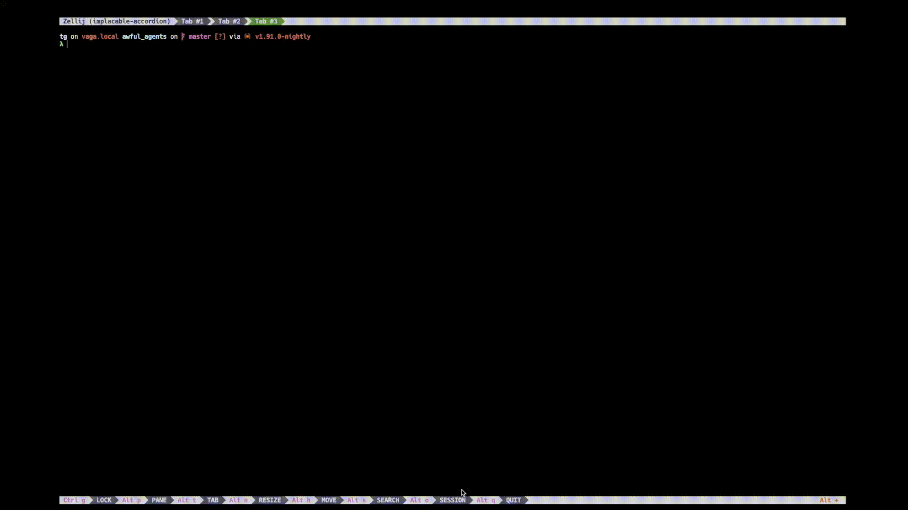

# Awful Rustdocs 📜

[](https://crates.io/crates/awful_rustdocs)

Awful Rustdocs is a CLI that generates or improves Rustdoc comments by harvesting symbols via rust_ast.nu, enriching each item with ast-grep context (callers, intra-body calls, qualified paths), and prompting Awful Jade to produce concise, high-quality docs. 

It writes the results back to source at the correct locations while preserving attributes like #[derive(...)] and #[serde(...)].



It supports:
- **Functions**: signature, callers, referenced symbols, and calls within the function's span.
- **Structs**: one-paragraph struct summary (inserted above attributes) plus inline field comments inferred from the struct body and code references (via LLMs with Structured Output).
- **Selective processing**: `--only` matches simple names or fully qualified paths (case-sensitive).
- **Safe, idempotent edits**: `--overwrite` is off by default.

## 🏃🏻‍♀️‍➡️ Quickstart

```nushell
cargo install awful_rustdocs
cd your-crate
curl -L https://raw.githubusercontent.com/graves/nu_rust_ast/HEAD/rust_ast.nu -o rust_ast.nu
awful_rustdocs init        # install default config & templates
awful_rustdocs --limit 1   # smoke test (no writes)
```

## 🧑🏿‍🚀 How it works

1. **Harvest items with rust_ast.nu**

You provide (or use the default) Nu script [rust_ast.nu](https://github.com/graves/nu_rust_ast) that emits a list of items (at least `fn` and `struct`) with fields like:
- `kind` ("fn", "struct")
- `file`, `fqpath`, `name`, `visibility`
- `signature` (the item line the user would see)
- `span` (start/end line/byte)
- `doc` (existing comment, if any)
- `body_text` (item body where present)
- `callers` (if your pipeline includes it)

These rows are read by Awful Rustdocs and grouped per file.

2. **Augment context with [ast-grep](https://ast-grep.github.io/guide/quick-start.html)**

For functions (unless disabled):
-  Call sites inside the function body (plain, qualified, method).
-  Qualified paths `(A::B, A::<T>::B, A::{...})` discovered by pattern queries.

_These additional hints help the LLM write better docs._

3. **Pick the right [template](https://github.com/graves/awful_rustdocs?tab=readme-ov-file#template-tips)**

Two templates are loaded from your Awful Jade template directory:
- `--template` (default: `rustdoc_fn`): for functions
- `--struct-template` (default: `rustdoc_struct`): for structs + fields

The struct template is expected to specify a `response_format` JSON schema. The model returns structured JSON that contains:
- A doc for the struct (short summary, no sections).
- A list of `fields[]` (name + rustdoc text) to be inserted inline.

_You have full control over wording and constraints in those templates._

4. **Ask Awful Jade**

For each item:
- Build a rich, markdown prompt with identity, existing docs, and context.
- For functions, the model returns a plain `///` block.
- For structs, the model returns JSON conforming to your `response_format` schema (see next section), from which the program extracts:
- The top struct doc (converted into a strict `///` block),
- The per-field docs (each as a single `///` line or short block).

All model output is passed through sanitizers:
- `strip_wrappers_and_fences_strict`: safely removes wrapper tokens (e.g., `ANSWER:`) only when they appear at line starts and outside fences; it won’t nuke inline code examples.
- `sanitize_llm_doc`: converts any prose to strict `///` lines; trims double-blanks; balances fences; removes a leading empty `///` if present.

5. **Patch files safely**

For each edit, the patcher:
- Finds the right insertion window.
-   Functions: directly above the function signature (consumes an immediately preceding blank if present).
-   Structs: above attributes (e.g., `#[derive]`, `#[serde]`) so the doc block sits at the very top, preserving the attribute group below.
-   Fields: immediately above the field, above any field attributes; aligned to field indentation.
- Skips any item that already has docs unless `--overwrite` is set.
- Applies all edits from the bottom up to avoid shifting line offsets.
- Writes artifacts to `target/llm_rustdocs/docs.json`.

The program will:
- Convert doc to a strict `///` block placed above any attribute lines that decorate the struct.
- Insert each `fields[].doc` as `///` immediately above the corresponding field, with the field’s current indentation and preserving any field attributes below the doc.

## 💾 Installation

**Requirements:**
- Rust (stable)
- Nushell (nu) to run `rust_ast.nu`
- `ast-grep` (CLI) for call/path discovery in functions
- Awful Jade config & templates (see `--config`, `--template`, `--struct-template`)

0. **Prerequisites**

You’ll need:
- Rust & Cargo (stable)
	- macOS/Linux: https://rustup.rs
	- Windows (PowerShell): `winget install Rustlang.Rustup`
- Nushell (nu)
	- macOS: `brew install nushell`
	- Linux: `snap install nushell --classic` or `cargo install nu`
	- Windows: `winget install nushell`
- `ast-grep` (CLI)
	- macOS: `brew install ast-grep`
	- Linux: download release from GitHub or cargo install `ast-grep-cli`
	- Windows: scoop install `ast-grep` or download release
- Python 3.11 and pytorch (Please consult the docs for your OS)
  - `brew install miniconda`
  - `conda create -n aj python=3.11`
  - `conda activate aj`
  - `pip install torch==2.4.0`
- Add the following to your shell initialization:
  - `export LIBTORCH_USE_PYTORCH=1`
  - `export LIBTORCH='/opt/homebrew/Caskroom/miniconda/base/pkgs/pytorch-2.4.0-py3.11_0/lib/python3.11/site-packages/torch'`
  - `export DYLD_LIBRARY_PATH="$LIBTORCH/lib"`

💡 Tip: Verify all dependencies are installed.
```nushell
cargo --version
nu --version
ast-grep --version
```

1. Install the CLI
```nushell
cargo install awful_rustdocs
```
This installs the awful_rustdocs binary into ~/.cargo/bin. Make sure that directory is on your PATH.

2. **Initialize defaults**

Run once to install the default config and templates into Awful Jade’s configuration directory:
```nushell
awful_rustdocs init
```
Use `--force` to overwrite existing files, or `--dry-run` to preview what would be written.

By default, files are placed under the standard platform-specific config directory:
- macOS: `~/Library/Application Support/com.awful-sec.aj/`
- Linux: `~/.config/awful_jade/`
- Windows: `%APPDATA%\awful_jade\`

Do you want me to add a short table showing exactly which files (rustdoc_config.yaml, rustdoc_fn.yaml, rustdoc_struct.yaml) end up in those directories after init?

3. **Get `rust_ast.nu`**

Your binary defaults to `--script rust_ast.nu` (looked up in the current working directory). Place it in your repo root or wherever you’ll run the command from.
```nushell
http get https://raw.githubusercontent.com/graves/nu_rust_ast/HEAD/rust_ast.nu | save rust_ast.nu
```
_Or `git clone https://github.com/graves/nu_rust_ast` and copy rust_ast.nu from there. I prefer to have it saved in my `$"($nu.data-dir)/scripts"` directory and sourced by `$nu.config-file` to use the functions it provides whenever I need them._

4. **Quick smoke test**

From your project root:
```nushell
awful_rustdocs --limit 1
```
You should see `target/llm_rustdocs/docs.json` produced. This confirms the harvesting pipeline and template loads are working. Nothing is written to your source files unless you add `--write`.

_If you hit any bumps, ping me with the error output and the snippet—you’ve already got a solid pipeline, so it’s typically a problem with the templates or config._

## 💻 Command-line usage

```nushell
λ awful_rustdocs run --help
```
```
(default) Generate rustdocs using current options

Usage: awful_rustdocs run [OPTIONS] [TARGETS]...

Arguments:
  [TARGETS]...  Paths (files/dirs) to analyze (default: ".")

Options:
      --script <SCRIPT>
          Path to your rust_ast.nu (the Nu script you shared) [default: rust_ast.nu]
      --write
          Write docs directly into source files (prepending ///)
      --overwrite
          Overwrite existing rustdoc if present (default: false; only fills missing)
      --session <SESSION>
          Session name for Awful Jade; if set, enables memory/session DB
      --limit <LIMIT>
          Limit the number of items processed (for testing)
      --no-calls
          Skip per-function ast-grep call-site analysis
      --no-paths
          Skip per-function qualified path analysis
      --fn-template <FN_TEMPLATE>
          Template for functions (expects response_format JSON) [default: rustdoc_fn]
      --struct-template <STRUCT_TEMPLATE>
          Template for structs+fields (expects response_format JSON) [default: rustdoc_struct]
      --config <CONFIG>
          Awful Jade config file name under the app config dir (changed default to match the new init filename) [default: rustdoc_config.yaml]
      --only <SYMBOL>...
          Only generate docs for these symbols (case-sensitive)
  -h, --help
          Print help
```

## 🤸🏼 Examples

1. Dry-run over the whole repo (no file changes).
```nushell
awful_rustdocs
```
_Artifacts go to `target/llm_rustdocs/docs.json`._

2. Write missing function docs for all Rust files to stdout, recursively, starting in `src/`.
```nushell
awful_rustdocs src --write
```

3. Overwrite all existing function docs.
```nushell
awful_rustdocs --write --overwrite
```

4. Document a single function by name (case-sensitive).
```nushell
awful_rustdocs --only do_work --write
```

5. Document a specific function by fully-qualified path.
```nushell
awful_rustdocs --only my_crate::utils::do_work --write
```

6. Document one struct and its fields only.
```nushell
awful_rustdocs --only my_crate::types::Config --write
```

## ⚠️ Insertion rules & safety
- **Struct docs**: Placed above the attribute block (`#[derive]`, `#[serde]`, etc) so attributes remain directly attached to the struct item.
- **Field docs**: Placed above the field, and above any field attributes. Indentation matches the field line so the comments are visually aligned.
- **Function docs**: Inserted directly above the `fn` signature.
- **Overwrite behavior**:
  - Without `--overwrite` (default), items that already have docs are skipped.
  - With `--overwrite`, the existing doc lines are replaced.
- **Bottom-up edits**: All edits per file are sorted by descending byte offset, so earlier patches don’t shift the spans of later ones.

## 🤖 Output artifacts
- `target/llm_rustdocs/docs.json` — a structured dump of everything generated:
```json
[
  {
    "kind": "fn",
    "fqpath": "...",
    "file": "src/...rs",
    "start_line": 123,
    "end_line": 167,
    "signature": "pub fn ...",
    "callers": ["..."],
    "referenced_symbols": ["..."],
    "llm_doc": "/// lines...\n/// ...",
    "had_existing_doc": false
  }
]
```

## 💡 Template tips
- **Function template** (`rustdoc_fn.yaml`):
  - Have assistant return only a `///` block (no backticks, no prose outside).
  - 1–2 sentence summary.
  - Optional sections: `Parameters:`, `Returns:`, `Errors:`, `Safety:`, `Notes:`, `Examples:`
  - Doc-test friendly examples (no fenced code unless necessary).
  - Avoid leading empty `///`.
- **Struct template** (`rustdoc_struct.yaml`):
  - Ask for concise prose and a `fields[]` array.
  - Ask it to return only JSON.

### JSON schema for struct `response_format`.

Your `--struct-template` should define a strict response_format similar to:
```yaml
response_format:
  name: rustdoc_struct_v1
  strict: true
  description: Rust struct docs plus per-field inline docs.
  schema:
    type: object
    properties:
      doc:
        type: string
        description: A short 1–2 sentence struct summary. No headings, no lists. Pure prose.
      fields:
        type: array
        description: Inline field docs. Ignored if field name not found in struct body.
        items:
          type: object
          properties:
            name:
              type: string
              description: Field identifier exactly as it appears in the struct.
            doc:
              type: string
              description: The rustdoc content for this field (one or a few `///` lines of prose).
          required: [name, doc]
    required: [doc, fields]
```
Your `system_prompt`, `pre`, `post` user messages should instruct the model to:
- Return only JSON conforming to that schema (no prose).
- Keep the struct summary short and field docs concise.
- Avoid restating types unless it clarifies semantics (units, invariants, ranges).
- Preserve exact field names.

## 🧯 Behavior that prevents mangling
- Wrapper token stripping is only applied at line starts and outside fences, and is skipped if the payload already looks like a rustdoc block.
- **Sanitization**:
  - Collapses repeated blank lines into single `///`.
  - Ensures every line starts with `///`.
  - Removes a single leading blank `///` if present.
  - Balances code fences (`///` ` ```rust … ///`),
  - Leaves inline code alone.

## 😣 Troubleshooting
- **Attributes were moved/removed**:
	- Struct and field patchers only target doc lines and are designed to leave `#[...]` blocks untouched. If you see attributes removed, verify your template didn’t emit attribute-like text and that you’re not running another formatter concurrently.
- **A single struct looks garbled**:
	- This usually means the model emitted stray characters or mixed prose when it should have returned only JSON (for structs). Tighten the `response_format` constraints and system rules; consider enabling `strict: true`.
- **No fields were commented**:
	- Ensure your struct template returns the `fields[]` array with exact field names as they appear in the code. The patcher only inserts for names it can find.
- Function analysis is slow:
	- Try -`-no-calls` and/or `--no-paths` to skip `ast-grep` passes.

## 🪜 Limitations
- The tool assumes reasonably idiomatic Rust formatting for matching signatures and fields.
- Exotic macro-expanded items may not be discoverable or patchable.
- The field matcher is heuristic; very complex multi-line field definitions may require tweaks.

## 🪪 License

CC0-1.0
